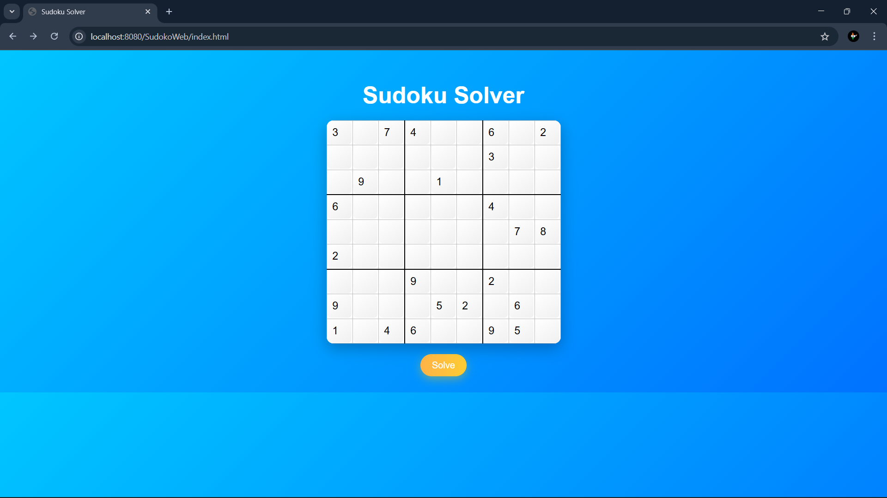
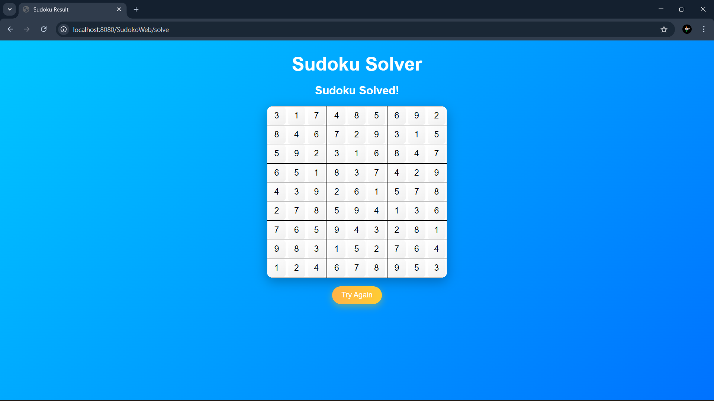

# 🧩 Sudoku Solver – Java + Servlets + Backtracking

A web-based Sudoku Solver built using **Java Servlets** and the **Backtracking Algorithm** to solve puzzles instantly.  
This project demonstrates how **Data Structures & Algorithms** can be applied in real-world applications.

---

## 🚀 Features
- Solves any valid Sudoku puzzle using backtracking.
- Checks constraints for rows, columns, and 3×3 subgrids.
- User-friendly interface with HTML & CSS.
- Deployed on local Tomcat server.

---

## 📸 Screenshots

### Input (Unsolved Sudoku)


### Output (Solved Sudoku)


---

## 🛠 Tech Stack
- **Java**
- **Servlets**
- **HTML5**
- **CSS3**
- **Backtracking Algorithm**
- **2D Arrays**

---

## 📜 How It Works
1. **User Input:** Enter numbers into the Sudoku grid. Empty cells remain blank.
2. **Validation:** The backend checks whether a number can be placed without breaking Sudoku rules.
3. **Solving:** Uses **recursive backtracking** to fill in empty cells until the puzzle is solved.
4. **Output:** Displays the solved Sudoku grid.

---

## 🔍 Key Algorithm (Backtracking)
```java
public boolean solve(int[][] board) {
    for (int row = 0; row < SIZE; row++) {
        for (int col = 0; col < SIZE; col++) {
            if (board[row][col] == 0) {
                for (int num = 1; num <= SIZE; num++) {
                    if (isValid(board, row, col, num)) {
                        board[row][col] = num;
                        if (solve(board)) return true;
                        board[row][col] = 0; // backtrack
                    }
                }
                return false;
            }
        }
    }
    return true;
}
